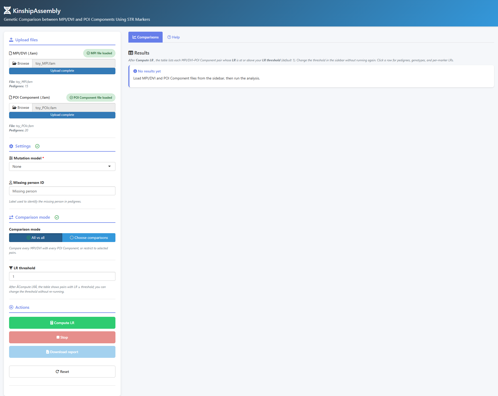
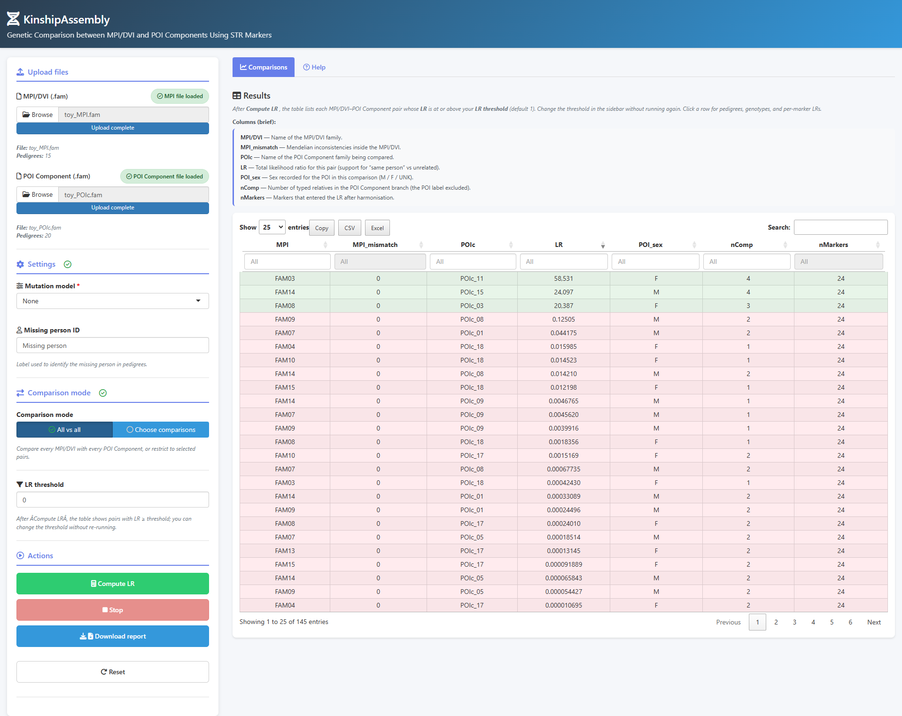
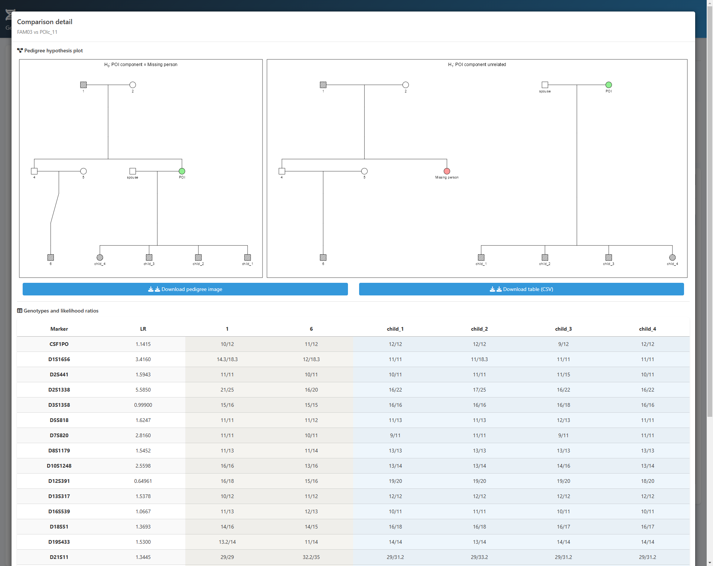

# 🧬 KinshipAssembly

--------------------------------------------------------------------------------

## 🔍 Introduction

**KinshipAssembly** is a **Shiny** application designed for humanitarian and forensic **MPI/DVI (Missing Person Identification / Disaster Victim Identification)** workflows, especially in cases where the missing or deceased person cannot provide a direct genetic profile (for example, when only skeletal remains recovered from mass graves are available, or in identity theft/identity substitution investigations). In these scenarios, identification depends on reference relatives and on testing potential biological family groups (**POI Components / POIc**) to evaluate whether they are related to the missing person and support eventual restitution to families.

To do this, the app compares **MPI/DVI** family pedigrees against **POI Component** pedigrees using **STR** markers and computes a **likelihood ratio (LR)** for each MPI/DVI-POI pair with `forrel::kinshipLR()`, quantifying support for "same person" versus "unrelated" hypotheses. Through a browser-based interface, users upload two Familias **`.fam`** files, run **all-vs-all** or selected comparisons, configure mutation models and an **LR threshold**, and review results in an interactive table with row-level detail (pedigrees, genotypes, per-marker LRs) and CSV export.

--------------------------------------------------------------------------------

## 🚀 Key Features

- **Dual upload workflow**  
  * Separate uploads for **MPI/DVI (.fam)** and **POI Component (.fam)**; MPI/DVI first keeps the comparison list consistent with the app logic.

- **Flexible comparison mode**  
  * **All vs all** runs every MPI/DVI pedigree against every POI Component family.  
  * **Choose comparisons** restricts to selected pedigree names after both files are loaded.

- **Mutation modelling**  
  * **None**, **Equal**, or **Extended stepwise** (with rate / range parameters) applied before LR calculation, aligned with the in-app Help tab.

- **Results table + drill-down**  
  * Columns include MPI/DVI name, Mendelian inconsistencies on the MPI/DVI side, POI Component name, **LR**, POI sex, number of typed relatives in the POI branch (**nComp**), and markers used (**nMarkers**).  
  * Click a row for pedigrees, genotypes, per-marker LRs, and downloads.

- **LR threshold without re-run**  
  * After **Compute LR**, adjust the threshold to filter rows; no need to recalculate.

- **Export**  
  * **Download report** saves a CSV of the visible rows plus a short summary block.

- **Large uploads**  
  * Shiny request size is raised to **100 MB** per request in `global.R` (suitable for bigger `.fam` files when the server allows it).

--------------------------------------------------------------------------------

## 📋 Requirements

- **Genetic data**: Two pre-configured **`Familias3`** **`.fam`** files suitable for this workflow—one describing **MPI/DVI** families and one **POI Component** families, with a **frequency table** and **STR** (or compatible) locus setup as expected by **pedFamilias** / **pedtools** / **forrel**.  
  To install Familias, see [Familias3](https://familias.no/).

- **R version**: **4.5.0 or higher**.

- **R packages** (also enforced at startup in `global.R`):

  - **Shiny & UI**: `shiny`, `later`, `DT`, `htmlwidgets`, `shinyjs`, `shinyWidgets`  
  - **Pedigree / LR**: `pedtools`, `kinship2`, `pedmut`, `forrel`, `pedFamilias`  
  - **Data**: `tibble`, `dplyr`, `purrr`, `stringr`

--------------------------------------------------------------------------------

## 🛠 Installation & Setup

1. **Download manually** or **clone the repository**.

   ```bash
   git clone https://github.com/sbiagini0/KinshipAssembly.git
   cd KinshipAssembly
   ```

2. **Install R packages** (if any are missing, the app will stop with an explicit `install.packages(...)` hint). To install everything in one go:

   ```r
   install.packages(c(
     "shiny", "later", "DT", "htmlwidgets",
     "shinyjs", "shinyWidgets",
     "pedtools", "kinship2", "pedmut", "forrel",
     "pedFamilias",
     "tibble", "dplyr", "purrr", "stringr"
   ), dependencies = TRUE)
   ```

3. **Open the project in RStudio** (or any R session with the working directory set to the app folder).

--------------------------------------------------------------------------------

## ▶️ Usage Instructions

1. **Launch the app**

   ```r
   shiny::runApp()
   ```

   Or in RStudio: open `app.R` and use **Run App**.

2. **Upload files (sidebar)**  
   - Choose the **MPI/DVI (.fam)** file, then the **POI Component (.fam)** file.

3. **Settings**  
   - **Mutation model** and **Missing person ID** must match how your pedigrees label the missing individual (spelling matters).  
   - Optional: adjust mutation rate / ranges when using **Equal** or **Extended stepwise**.

4. **Comparison mode**  
   - **All vs all** or **Choose comparisons** (select specific MPI/DVI and POI Component pedigree names when both files are loaded).

5. **Run**  
   - Click **Compute LR**. Use **Stop** to cancel a long job.

6. **Review results**  
   - Open the **Comparisons** tab. Set **LR threshold** to hide pairs below your cut-off (default **1**); this does not require re-running the analysis.  
   - **Click a row** for pedigree plots, genotypes, per-marker LRs, and image/CSV downloads where available.

7. **Export & reset**  
   - **Download report** exports the currently filtered table as CSV (with summary footer).  
   - **Reset** clears uploads and session results for a new case.

8. **Help**  
   - The in-app **Help** tab summarizes quick start, caveats (allele harmonisation, missing data, runtime), and technical notes (H0/H1 structure, mutation handling, marker rules).

--------------------------------------------------------------------------------

## ⚙️ Technical notes (brief)

- **Hypotheses**: H0 — missing person is the POI (merged pedigree); H1 — unrelated (MPI/DVI branch vs POI Component branch). **LR** = P(data | H0) / P(data | H1) via `kinshipLR`.  
- **Markers**: Locus order follows the MPI/DVI file; MPI/DVI and POI Component panels are harmonised; alleles outside the panel are treated as missing for consistency.  
- **Single-side markers**: Markers typed on only one side may be excluded from the numeric product LR (partial factor 1) to avoid misleading factors—see app Help for the exact behaviour.

--------------------------------------------------------------------------------

## 🖼️ App screenshots

### 1) Data loaded and ready to run

This view shows both `.fam` files already loaded (MPI/DVI and POI Component), with pedigree counts visible and upload status confirmed. The sidebar also shows the analysis controls (mutation model, missing person ID, comparison mode, and LR threshold), so the case is ready for **Compute LR**.



### 2) Comparison results table

After loading both `.fam` files and running **Compute LR**, the **Comparisons** tab displays an interactive table with one row per MPI/DVI-POI pair, including LR and additional metadata (`MPI_mismatch`, `POI_sex`, `nComp`, `nMarkers`).



### 3) Comparison detail (Pedigree Hypothesis Plot + Genotype and Likelihood Ratios)

By clicking a row in the results table, a detail window opens with side-by-side pedigree hypothesis plots and a genotype table with per-marker likelihood ratios. This panel also provides direct download buttons for image and CSV outputs.



--------------------------------------------------------------------------------

## 📚 Citations

### pedsuite (pedtools, forrel, pedFamilias)

- **Vigeland, M. D.** (2020). *Pedigree Analysis in R*. Academic Press. https://doi.org/10.1016/C2020-0-01956-0

--------------------------------------------------------------------------------

## 📝 License

MIT License — see [LICENSE](LICENSE) for details.

--------------------------------------------------------------------------------
